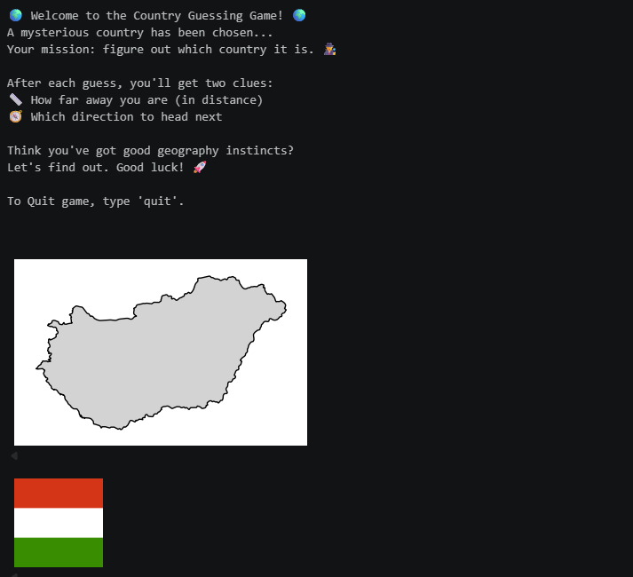
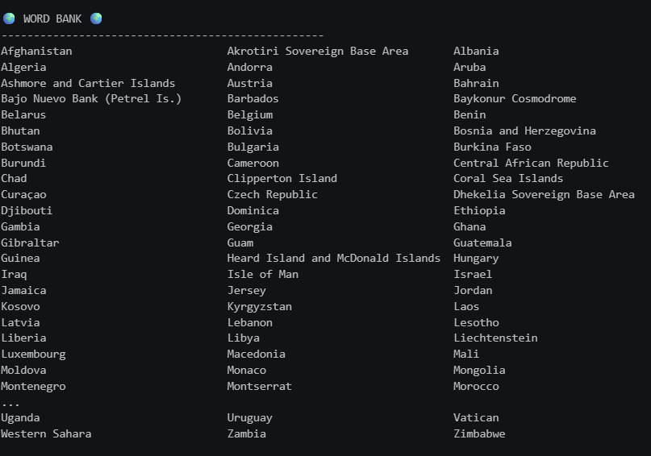
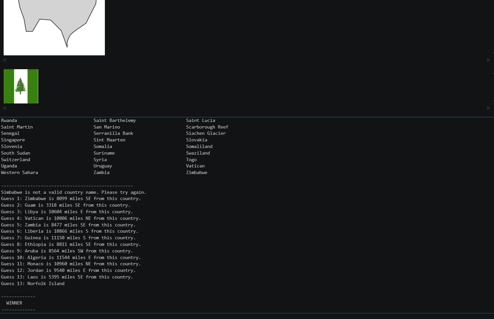

# 🌍 Country Guessing Game (GeoWordle)

A geography-based guessing game inspired by Wordle, where players try to identify a randomly selected country using distance and direction feedback.

---

## 🎮 Overview

This project is a notebook-based geography game that uses a **GeoJSON dataset of world countries** to randomly select a target country. The player must guess the correct country based on feedback provided after each attempt.

Unlike traditional Wordle, this game uses real-world geographic calculations:

- 📏 Distance between countries (in kilometers/miles)
- 🧭 Direction from guess → target country
- 🌍 Map visualization of the target country
- 🚩 Country flag display for added feedback

---

## 🧠 How the Game Works

1. A random country is selected from a GeoJSON dataset.
2. The country is displayed on a map (silhouette view).
3. The player enters guesses.
4. After each guess, the game provides:
   - Distance from guessed country to correct country
   - Compass direction (N, NE, E, etc.)
   - Optional visual feedback (flags / maps)
5. The game ends when the correct country is guessed.







---

## 📊 Game Features

- Random country selection from GeoJSON data
- Haversine distance calculation between coordinates
- Compass direction calculation (8-direction system)
- Country centroid calculation using geometry
- Word bank of available countries
- Flag display using JSON metadata
- Clean map visualization using GeoPandas + Matplotlib

---

## 📂 Project File Overview

| Files / Folders        | Description |
|------------------------|-------------|
| **wordle.ipynb**       | Main notebook containing the game logic, map rendering, and user interaction loop. |
| **data/**              | Stores dataset files including `countries.geojson` and `country.json` used for country metadata and geometry. |
| **flags/**             | Contains country flag images in `1x1` and `4x3` formats used for visual feedback in the game. |
| **screenshots/**       | Contains screenshots of running game. |
| **lib/**               | Custom Python package containing helper functions for distance, direction, and geometry calculations. |
| ├── `formulas.py`      | Implements Haversine distance, bearing calculations, and centroid (country center) functions. |
| ├── `__init__.py`      | Initializes the `lib` package for easy imports. |
| **README.md**          | Project documentation, overview, and setup instructions. |


---

## 🧮 Core Algorithms

### 📏 Distance Calculation (Haversine Formula)

Used to compute real-world distance between two latitude/longitude points on Earth.

---

### 🧭 Direction Calculation

Converts a bearing angle into an 8-direction compass system:
N, NE, E, SE, S, SW, W, NW


---

### 🌍 Country Center Calculation

Each country’s centroid is calculated from its polygon geometry using GeoPandas/Shapely.

---

## 🚩 Flag System

Each country is mapped to its flag using a JSON lookup file:

```json
{
  "name": "Afghanistan",
  "flag_1x1": "flags/1x1/af.svg"
}